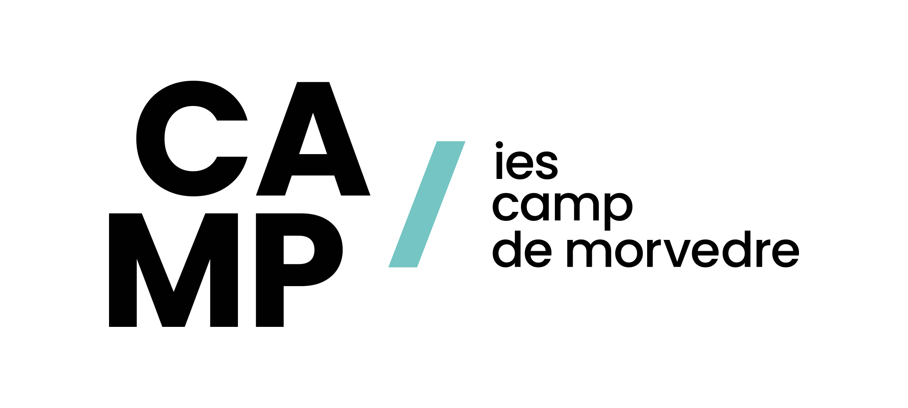

# UD1 Introducción e Instalación
## Desarrollo Web en Entorno Servidor

IES CAMP DE MORVEDRE

Prof:<a  href="mailto:ma.capillaherrero@edu.gva.es"> ma.capillaherrero@edu.gva.es</a>

---
<!-- paginate: true -->
## Introducción

Este curso trabajaremos usando Docker. 

###  ¿Por qué usaremos Docker para nuestro entorno de desarrollo?

Para el módulo de desarrollo web en entorno servidor, vamos a dar un paso adelante en nuestra forma de trabajar. Dejaremos de depender de herramientas como XAMPP o WAMP para adoptar una solución profesional y muy utilizada en la industria: Docker. 

---

## 1. ¿Qué es Docker y qué beneficios nos aporta?

Imagina que quieres montar una orquesta. En lugar de tener a cada músico con su propio instrumento en casa, Docker nos permite crear un "escenario" portable y auto-contenido, al que llamamos contenedor. Dentro de ese escenario, tenemos todo lo que necesitamos: la batería (nuestro servidor web), las guitarras (nuestro intérprete de PHP), y el piano (nuestra base de datos). Lo mejor de todo es que este escenario funciona exactamente igual, sin importar si lo montamos en un Windows, un Mac o un Linux. Esto es lo que se conoce como portabilidad.

La principal diferencia con XAMPP o WAMP es que estos últimos instalan los servicios directamente en tu sistema operativo, lo que puede generar conflictos con otros programas. Docker, en cambio, aísla cada servicio en su propio contenedor, como si fuera una máquina virtual super ligera.

Con Docker, evitamos los temidos "en mi máquina funciona", porque el entorno de desarrollo es idéntico para todo el equipo y en cualquier sistema. Esto nos permite:

* Aislar dependencias: Si un proyecto necesita PHP 8.1 y otro PHP 8.2, no hay problema. Cada uno vive en su propio contenedor sin interferir con los demás.

* Replicar el entorno de producción: Podemos hacer que nuestro entorno de desarrollo sea lo más parecido posible al servidor donde se publicará la web final.

[ Más info sobre Docker ](https://docs.docker.com/get-started/docker-overview/)

---

## 2. ¿Qué tendremos dentro de nuestro contenedor Docker?

En lugar de instalar individualmente Apache, MySQL y PHP, vamos a definir un conjunto de servicios en un archivo llamado docker-compose.yml. Para nuestro proyecto con Laravel, el contenedor principal incluirá:

1. Nginx: Será nuestro servidor web. Nginx es un servidor muy eficiente y popular en la industria para servir peticiones HTTP. Lo usaremos en lugar de Apache.

2. PHP-FPM: Este es el intérprete de PHP. En la arquitectura moderna de servidores web, el servidor web (Nginx) y el intérprete de PHP son servicios separados que se comunican entre sí. Esto nos da un rendimiento superior.

3. MariaDB o MySQL: Nuestra base de datos, un pilar fundamental para cualquier aplicación web. La tendremos en su propio contenedor, aislada del resto.

4. Redis: Utilizaremos este servicio para la gestión de caché y colas, una práctica muy común en el desarrollo de aplicaciones Laravel para mejorar el rendimiento.

5. Composer y Node.js: Para gestionar las dependencias de PHP y de JavaScript. Estos no serán servicios en sí mismos, sino herramientas que utilizaremos dentro de los contenedores para gestionar las librerías necesarias.

Todos estos servicios estarán interconectados dentro de la red privada de Docker, comunicándose entre sí sin necesidad de exponerlos a nuestro sistema operativo. Esto nos da un control total y una gran flexibilidad.

En resumen, Docker nos permite tener un entorno de desarrollo profesional, limpio, portable y que reproduce de forma fiel las condiciones del entorno de producción. Es una habilidad fundamental en el desarrollo web moderno, y dominarla nos preparará para los desafíos del mercado laboral.

<!-- class: invert -->
<!-- paginate: false -->

## Fin de la presentación

IES CAMP DE MORVEDRE

Prof: <a  href="mailto:ma.capillaherrero@edu.gva.es"> ma.capillaherrero@edu.gva.es</a>
